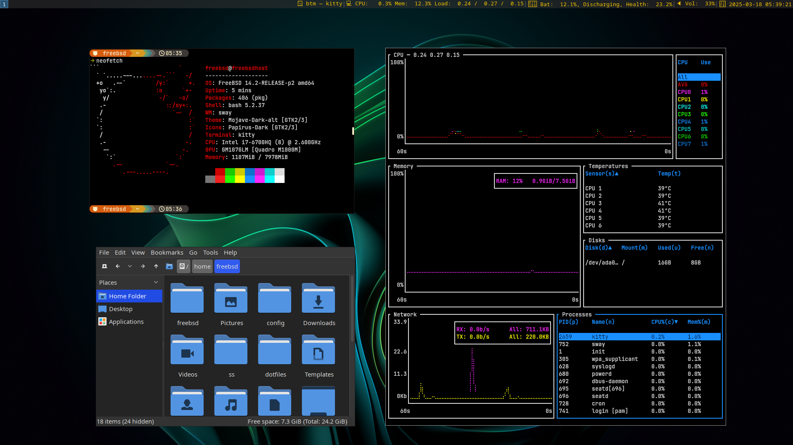

# Cara install freebsd 14 di thinkpad p50



Di sini saya ingin install triple boot nixos, arch, dan freebsd. 

Untuk freebsd saya install paling terakhir.

Semua proses booting diatur melalui GRUB nixos.

## partisi disk

Saya menyiapkan 25 gb partisi untuk freebsd.

## tahap instalasi

Sama seperti biasanya, install freebsd sangat mudah, tidak sampai 5 menit.

Pilih ports, base, dan 32bit compatibility.

Akan lebih baik juga jika mengaktifkan wifi, supaya bisa langsung mengakses internet melalui console.

### disk partisi

Jika partisi kosong yang sudah dibuat tertera di pilihan disk, hapus (D) lalu create (C).

>> akan muncul pesan untuk membuat partisi boot, pilih NO.

Karena kita tidak butuh itu, nanti boot nya diatur oleh GRUB nixos.

### membuat username

Setelah install, buat sebuah username, lalu tambahkan user ini ke grup (wheel, video, operator)

Reboot, lalu masuk ke nixos untuk menampilkan Freebsd ke menu GRUB saat booting.

### post instalasi

Setelah berhasil masuk ke freebsd, lakukan update.

```
# freebsd-update fetch
# freebsd-update install
```

### install driver

install driver video dan audio

```
# pkg install 

gpu-firmware-intel-kmod-skylake
libva-intel-driver
nvidia-driver
nvidia-drm-515-kmod
nvidia-xconfig
pulseaudio-module-sndio
wifi-firmware-iwlwifi-kmod-8000
xf86-video-intel
```

### jika tidak work, freebsd 14.2 harus compile manual drm-61-kmod dari ports

```
# cd /usr/ports/graphics/drm-61-kmod/
# make install clean
# reboot
```

### install additional package

```
# pkg install 

bash
bash-completion
bottom
chromium
dmenu
dmenu-wayland
ffmpegthumbnailer
git
jq
kitty
mpv
neofetch
nvim
nwg-look
pavucontrol
pcmanfm
sudo
tmux
wifimgr
wl-clipboard
wofi
yaru-icon-theme
```

## install sway

first thing first, before all, please install `wayland` and `seatd`

```
pkg install wayland seatd && sysrc seatd_enable="YES" && sysrc dbus_enable="YES" && service seatd start
```

```
# pkg install 
dbus
foot
seatd
swayfx
swayrbar
wayland
wayland-protocols
wofi
xdg-desktop-portal-wlr
xwayland
```

## setting file /etc/rc.conf

```
hostname="freebsdhost"
wlans_iwm0="wlan0"
ifconfig_wlan0="WPA DHCP" 
moused_nondefault_enable="NO"
# Set dumpdev to "AUTO" to enable crash dumps, "NO" to disable
dumpdev="NO"
#kld_load="i915kms"
#kld_list="nvidia nvidia-modeset nvidia-drm i915kms linux linux64"
#kld_list="i915kms nvidia-modeset linux linux64 acpi_call" #kernal i915kms harus ada meskipun install nvidia, karena nvidia tidak mendunkung drm
kld_list="i915kms linux linux64 acpi_call" #bisa run sway di intel saja tanpa nvidia
seatd_enable="YES"
dbus_enable="YES"
pipewire_enable="YES"
sound_load="YES"
snd_hda_load="YES"
pulseaudio_enable="YES"

# activate hibernate when close the lid
zzz_enable="YES"
acpi_ibm_load="YES"

#enable power saving, supaya tidak boros baterai.
powerd_enable="YES"

#disable service ini supaya tidak boros baterai.
sendmail_enable="NONE"
devd_enable="NO"
```

## setting file /boot/loader.conf

```
#hw.nvidiadrm.modeset=1
security.bsd.allow_destructive_dtrace=0
#snd_driver_load="YES"
hw.psm.synaptics_support="1"
ext2fs_load="YES" 	# to automatic load linux ext4 partiion
```

## setting audio

jika volume audio kecil, coba jalankan perintah `mixer pcm=1.0`

```
freebsd@freebsdhost:~ $ mixer
pcm0:mixer: <Realtek ALC298 (Analog 2.0+HP/2.0)> on hdaa0 (play/rec) (default)
    vol       = 1.00:1.00     pbk
    pcm       = 0.58:0.58     pbk
    speaker   = 0.74:0.74     rec
    mic       = 0.00:0.00     rec src
    mix       = 0.53:0.53     rec
    rec       = 0.53:0.53     pbk
    igain     = 0.00:0.00     pbk
    ogain     = 1.00:1.00     pbk
freebsd@freebsdhost:~ $ mixer vol
vol.volume=1.00:1.00
vol.mute=off
freebsd@freebsdhost:~ $ mixer pcm=1.0
pcm.volume: 0.58:0.58 -> 1.00:1.00
pcm0:mixer: <Realtek ALC298 (Analog 2.0+HP/2.0)> on hdaa0 (play/rec) (default)
    vol       = 1.00:1.00     pbk
    pcm       = 1.00:1.00     pbk
    speaker   = 0.74:0.74     rec
    mic       = 0.00:0.00     rec src
    mix       = 0.53:0.53     rec
    rec       = 0.53:0.53     pbk
    igain     = 0.00:0.00     pbk
    ogain     = 1.00:1.00     pbk
```

## install fonts

```
pkg install noto-sans-ch noto-sans-jp noto-sans-kr firacode liberation-fonts-ttf
```

## usefull command

```
- pciconf -lv | grep -B3 display >> display video card devices
- kldstat >> list all loaded kernel
- dmesg  >> display all system buffer
- gpart show >> show disk partition, just like lsblk in linux
- service netif restart >> to restart 
- ifconfig >> show wifi device = wlan0
- dhclient wlan0 >> select and run wlan0 to scan wifi
- ee /etc/wpa_supplicant.conf >> to edit wifi network
- sysctl -a | grep temperature >> to show cpu temperature
- sysctl dev.acpi_ibm.0.fan >> to show fan status, 1 is automatic, 0 is manual.
```

### example wpa_supplicant.conf file

```
network={
	ssid="MyWifi"
	scan_ssid=0
	psk="passwordwifi"
	priority=5
}
network={
	ssid="Warkop D2"
	psk="wifipasswordwarkop"
}

```

## edit /etc/fstab to use linux partition

first load linux kernel in /etc/rc.conf, then edit file /etc/fstab.

list all partition with `gpart show`, in this result my linux partition is on **ada0p2**.

```
# Device			Mountpoint		FStype	Options	Dump	Pass#
/dev/ada0p5			/			ufs	rw	1	1
proc 				/proc 			procfs 	rw	0	0

#mount my linux partition
/dev/ada0p2    			/mnt/nix    		ext2fs 	rw    	0    	0
/mnt/nix/home/nix/Videos	/home/freebsd/Videos 	nullfs 	rw	0    	0
```

ref tambahan:
- https://github.com/es-j3/FreeBSD-QuickSetup
